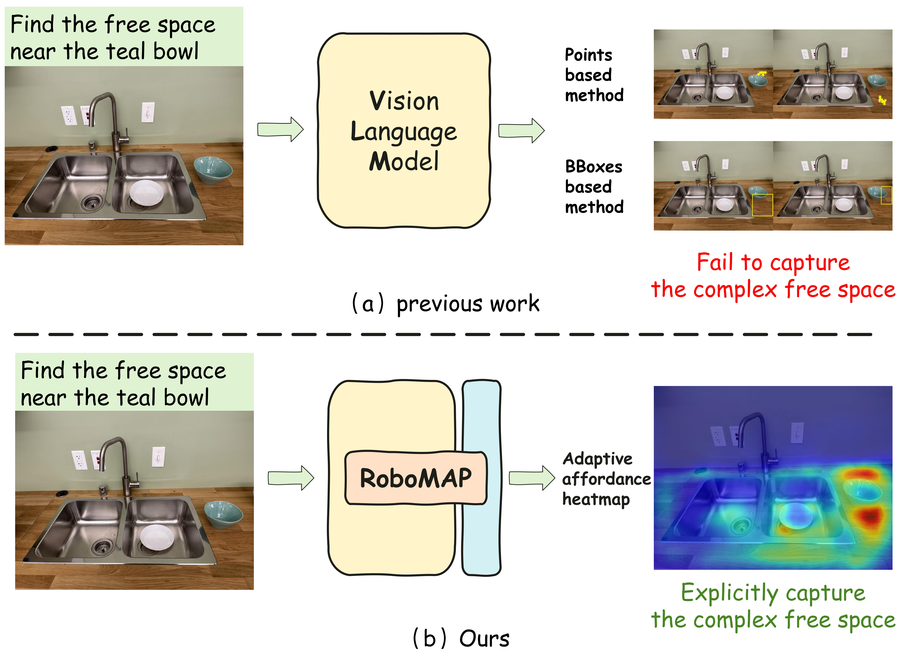
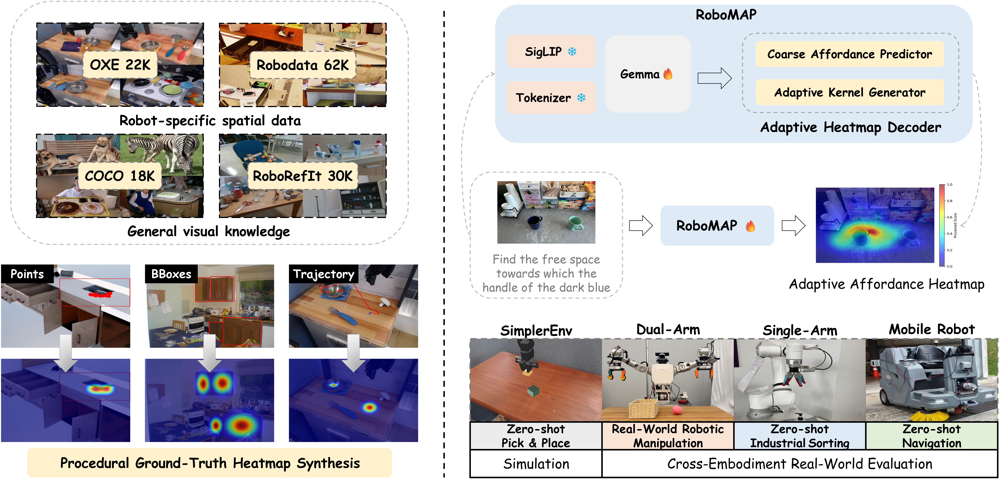
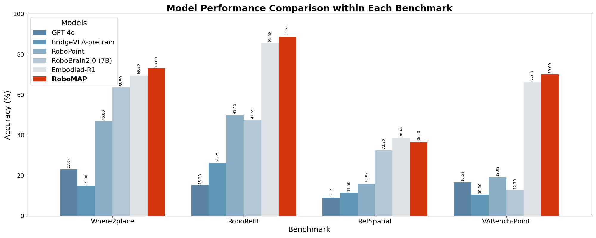
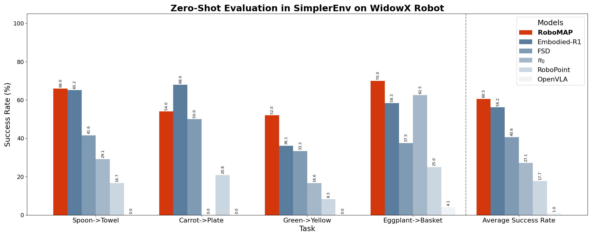
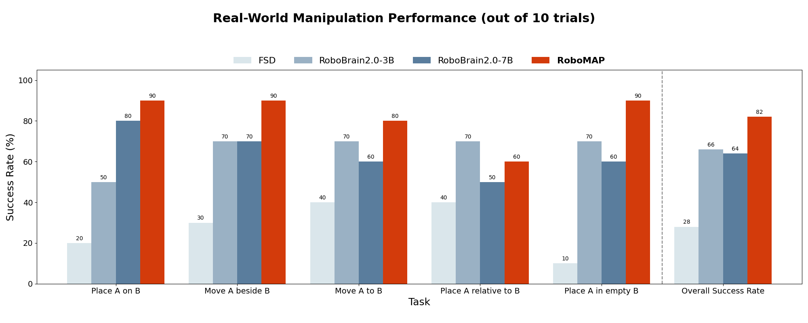

<div align="center">

# RoboMAP: More than a Point: Adaptive Affordance Heatmaps as VLM Grounding Interfaces for Robotics

[\[📄Paper\]](https://arxiv.org/abs/2510.10912)  [\[🏠Project Page\]](https://robo-map.github.io/)  [\[📹Video\]](https://www.youtube.com/watch?v=zfFt_MJnt4Y&embeds_referring_euri=https%3A%2F%2Frobo-map.github.io%2F&source_ve_path=OTY3MTQ&themeRefresh=1)

</div>

## 🔥 News
[2026.10] 🎉 RoboMAP has been accepted to CoRL 2026 as a Poster.

[2026.10] 📄 The project has been updated with the latest title and results. The work was previously titled *More than A Point: Capturing Uncertainty with Adaptive Affordance Heatmaps for Spatial Grounding in Robotic Tasks*.

[2025.10] 🚀 RoboMAP 发布！开源了论文、代码和 Demo。

[2025.10] 📄 论文 *More than A Point: Capturing Uncertainty with Adaptive Affordance Heatmaps for Spatial Grounding in Robotic Tasks* 已发布：[arXiv:2510.10912](https://arxiv.org/abs/2510.10912)。

## Abstract

Hierarchical VLM-based robotic systems often use sparse points or bounding boxes as intermediate spatial representations, which are inadequate for region-level grounding. This is particularly evident in instructions such as “place near the bowl,” which specify a feasible region rather than a single target point. We present RoboMAP, a VLM-based robotic grounding framework that uses adaptive affordance heatmaps as a language-conditioned intermediate interface between spatial reasoning and downstream modules. RoboMAP predicts dense score maps for continuous and object-free target regions, exposing feasible spatial support that downstream segmentation, grasping, and control modules can use beyond sparse prompts alone. To enable scalable training without manual dense labels, RoboMAP synthesizes heatmap supervision from heterogeneous annotations, including points, boxes, and robot trajectory data. Across four spatial grounding benchmarks evaluated with standard point-extraction metrics, RoboMAP obtains the best reported accuracy on three benchmarks while maintaining a 0.04 s grounding-stage forward pass. In 50 real-world dual-arm manipulation trials spanning five tabletop task types, it achieves an 82% success rate using heatmap-guided segmentation and grasp proposal. We further provide qualitative cross-embodiment demonstrations across manipulation and navigation scenarios.

## 🎯 Why RoboMAP?

🔥 Adaptive Affordance Heatmaps: Moves beyond imprecise point-based localization. RoboMAP generates "Adaptive Affordance Heatmaps" that model the observation space as a continuous probability distribution. The heatmap dynamically adapts to command ambiguity: forming sharp peaks for precise targets and wider distributions for vague instructions.

🎯 Uncertainty-Aware: Enables robots to explicitly capture and understand complex spatial concepts. When a command is ambiguous (e.g., "the cup nearby"), the heatmap naturally broadens to express uncertainty, enhancing the robustness of robot decision-making.

⚡️ Efficient Grounding: The VLM grounding-stage forward pass takes only 0.04 seconds. This measurement excludes downstream perception and execution, so it should not be interpreted as end-to-end robot control latency.



## Contents
- [Abstract](#abstract)
- [Model Overview](#Model-Overview)
- [Installation](#Installation)
- [Training](#Training)
- [Evaluation](#evaluation)
- [Experimental Results](#experimental-results)
- [Checkpoint Availability](#checkpoint-availability)
- [Acknowledgement](#Acknowledgement)
- [Contact](#Contact)
- [Citation](#Citation)

## 📋 Framework Overview
The RoboMAP framework (Fig. 1) first uses a vision-language backbone (PaliGemma) to encode an image $I$ and instruction $x$ into a low-resolution feature map $F_{\text{low}}$. Our novel Adaptive Heatmap Decoder (AHD) then translates these features into a high-resolution affordance heatmap $\hat{M}$ for spatial grounding.


*Fig. 1: Overall Architecture of the RoboMAP Framework.*

## 🛠️ Installation

### 1. Prerequisites: Access PaliGemma

Our model is built upon [PaliGemma](https://huggingface.co/google/paligemma-3b-pt-224), which is a gated repository on Hugging Face. You should first authenticate with Hugging Face and request access to the checkpoint.

### 2. Clone Repository

Clone this repository and navigate to the project directory:

```bash
git clone https://github.com/xyshao23/RoboMAP.git
cd RoboMAP
```

### 3. Create Environment & Install Packages

We recommend using conda to manage the environment.

```bash
conda env create -f environment.yml
conda activate robomap
```

Or, install dependencies using pip

```bash
pip install -r requirements.txt 
```

## 🚀 Training

You must configure your local data paths before running the training.

Open the configuration file: `config/pretrain_robomap_config.yaml`.

Locate the 1. PATH CONFIGURATION section.

Modify data_root1 and data_root2 to point to the root directories where your datasets are stored locally.

⚠️ Note: The script will fail immediately if these paths are not correctly set.

We use PyTorch's torchrun for efficient multi-GPU distributed training. A launch script is provided to handle all settings for you.

To start training, simply run:

```bash
bash pretrain_robomap.sh
```

This script will launch the training process on 4 GPUs (as defined by `GPUS_PER_NODE=4` in the script), using the settings from `config/pretrain_robomap_config.yaml`.

All experiments are implemented in PyTorch and were conducted on 4x NVIDIA L40 (48G) GPUs. We finetune the model for 2 epochs, keeping the vision encoder and token embeddings frozen. We use the AdamW optimizer with $\beta_1 = 0.9$, $\beta_2 = 0.999$, and a weight decay of 0.1. The learning rate warms up linearly to a peak of $3 \times 10^{-5}$ over the first 400 steps, followed by a cosine decay schedule. Training is performed with a global batch size of 384 using BF16 mixed precision, and the full process takes approximately 20 hours.

## 🧪 Inference

Pre-trained checkpoints and a standalone inference script are not currently included because of release and permission constraints. The repository currently focuses on the training and model implementation. After training a checkpoint, the model and pipeline components in `robomap/model.py` and `robomap/pipeline.py` can be used to integrate RoboMAP into a downstream application.

## 📈 Experimental Results

### Benchmarks(Where2place |RoboRefIt | RefSpatial | VABench-Point)

We benchmarked RoboMAP against both general-purpose VLMs (like GPT-4o and Gemini-2.5-pro) and leading specialized robotic grounding models.

As the results show, **RoboMAP achieves the best reported accuracy on three of the four key benchmarks**: `Where2place` (73.00%), `RoboRefIt` (88.73%), and `VABench-Point` (70.00%), while remaining competitive on `RefSpatial`.

The reported **0.04-second timing measures only the VLM grounding-stage forward pass**; downstream perception and execution are excluded. This distinction is important when comparing the timing with complete robotic systems.

| Model | Size | Finetune Method | Where2place (%) ↑ | RoboRefIt (%) ↑ | RefSpatial (%) ↑ | VABench-Point (%) ↑ | Grounding-stage Time (s) ↓ |
|:---|:---|:---|:---:|:---:|:---:|:---:|:---:|
| GPT-4o | - | - | 23.04 | 15.28 | 9.12 | 16.59 | - |
| Gemini-2.5-pro | - | - | 52.95 | 49.50 | 29.24 | 21.71 | - |
| Qwen2.5VL | 72B | - | 37.15 | 78.50 | 20.85 | 23.30 | - |
| GLM-4.5v | 106B | - | 29.89 | 74.50 | 11.19 | 29.23 | - |
| RoboPoint | 13B | SFT | 46.80 | 49.80 | 16.07 | 19.09 | 3.10 |
| RoboRefer | 2B | SFT | 66.00 | 72.80 | 33.77 | 24.67 | 1.54 |
| RoboBrain2.0 | 3B | - | 54.86 | 54.42 | 35.81 | 8.08 | 0.67 |
| RoboBrain2.0 | 7B | SFT + RFT | 63.59 | 47.55 | 32.50 | 12.70 | 10.41 |
| FSD | 13B | SFT | 45.81 | 56.73 | 14.90 | 61.82 | 15.68 |
| Embodied-R1 | 3B | SFT + RFT | *69.50* | *85.58* | **38.46** | *66.00* | 2.18 |
| BridgeVLA-pretrain | 3B | SFT | 15.00 | 26.25 | 11.50 | 10.50 | *0.06* |
| **RoboMAP** | **3B** | **SFT** | **73.00** | **88.73** | *36.50* | **70.00** | **0.04** |



### Zero-shot in Simulation(SimplerEnv)

This table shows the **zero-shot evaluation in the SimplerEnv simulation** using a WidowX robot. We compared RoboMAP against both VLA-based methods (like OpenVLA, $\pi_0$) and other VLM-based methods (like MOKA, Embodied-R1).

Even with no prior training in this environment, **RoboMAP achieves the highest reported overall success rate (60.5%)**. It outperforms all other methods, including strong specialized VLA models like $\pi_0$ FAST (32.1%) and VLM baselines like Embodied-R1 (56.2%).

This demonstrates RoboMAP's strong generalization capabilities in a dynamic simulation environment, with its strongest task-level results on `Spoon->Towel` and `Eggplant->Basket`.

| Model | Spoon$\rightarrow$Towel | Carrot$\rightarrow$Plate | Green$\rightarrow$Yellow | Eggplant$\rightarrow$Basket | Success Rate (%) |
|:---|:---:|:---:|:---:|:---:|:---:|
| OpenVLA | 0.0% | 0.0% | 0.0% | 4.1% | 1.0% |
| $\pi_0$ | 29.1% | 0.0% | 16.6% | 62.5% | 27.1% |
| $\pi_0$ FAST | 29.1% | 21.9% | 10.8% | *66.6%* | 32.1% |
| MOKA | 45.8% | 41.6% | 33.3% | 12.5% | 33.3% |
| SoFar | 55.5% | 56.9% | **62.5%** | 40.2% | 53.8% |
| RoboPoint | 16.7% | 20.8% | 8.3% | 25.0% | 17.7% |
| FSD | 41.6% | 50.0% | 33.3% | 37.5% | 40.6% |
| Embodied-R1 | *65.2%* | **68.0%** | 36.1% | 58.3% | *56.2%* |
| **RoboMAP** | **66.0%** | *54.0%* | *52.0%* | **70.0%** | **60.5%** |



### Generalization to Real World
To validate the practical utility of RoboMAP, we evaluated its **zero-shot generalization performance** in 50 real-world dual-arm manipulation trials spanning five tabletop task types. The robot was tasked with executing complex spatial commands it had never seen during training.

As shown in the table, **RoboMAP achieves 41/50 successes (82%)**, outperforming the compared baselines and demonstrating robust performance across challenging, ambiguous, and long-horizon tasks.

The reported **0.04-second timing refers to the grounding stage only**; it does not include downstream perception or robot execution.

| Method | Place [A] on [B] | Move [A] beside [B] | Move [A] to [B] | Place [A] rel. to [B] | Place [A] into empty [B] | Success Rate (%) | Grounding-stage Time (s) |
|:---|:---:|:---:|:---:|:---:|:---:|:---:|:---:|
| FSD | 2/10 | 3/10 | 4/10 | 4/10 | 1/10 | 28% | 15.68 |
| RoboBrain2.0-3B | 5/10 | *7/10* | *7/10* | **7/10** | *7/10* | *66%* | *0.45* |
| RoboBrain2.0-7B | *8/10* | *7/10* | 6/10 | 5/10 | 6/10 | 64% | 8.07 |
| **RoboMAP** | **9/10** | **9/10** | **8/10** | *6/10* | **9/10** | **82%** | **0.04** |



## 📦 Checkpoint Availability

Pre-trained checkpoints are not currently included because of release and permission constraints. Please follow the training instructions above to train a checkpoint locally.


</details>

## 🙏 Acknowledgement
We stand on the shoulders of giants, and our work in developing RoboMAP has been inspired and empowered by the remarkable open source projects in the field. We would like to extend our heartfelt gratitude to each of these initiatives and their dedicated developers.
- [PaliGemma](https://huggingface.co/google/paligemma-3b-pt-224)
- [RLBench](https://github.com/stepjam/RLBench/tree/master)
- [RoboPoint](https://github.com/wentaoyuan/RoboPoint)
- [BridgeVLA](https://github.com/BridgeVLA/BridgeVLA)

## ✉️ Contact
If you have any questions about the code, please contact shaoxy23@mails.tsinghua.edu.cn or tangyz24@mails.tsinghua.edu.cn.

## 📝 Citation
```bibtex
@misc{shao2026robomap,
  title = {More than a Point: Adaptive Affordance Heatmaps as VLM Grounding Interfaces for Robotics},
  author = {Shao, Xinyu and Tang, Yanzhe and Xie, Pengwei and Zeng, Long and Li, Xiu},
  year = {2026},
  howpublished = {arXiv preprint arXiv:2510.10912},
  note = {Accepted to CoRL 2026, Poster},
  url = {https://arxiv.org/abs/2510.10912}
}
```
