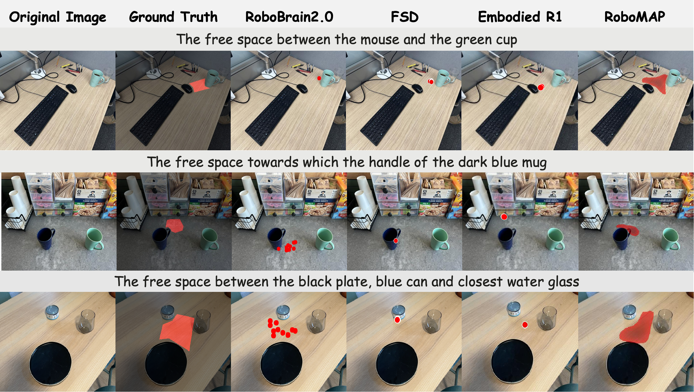
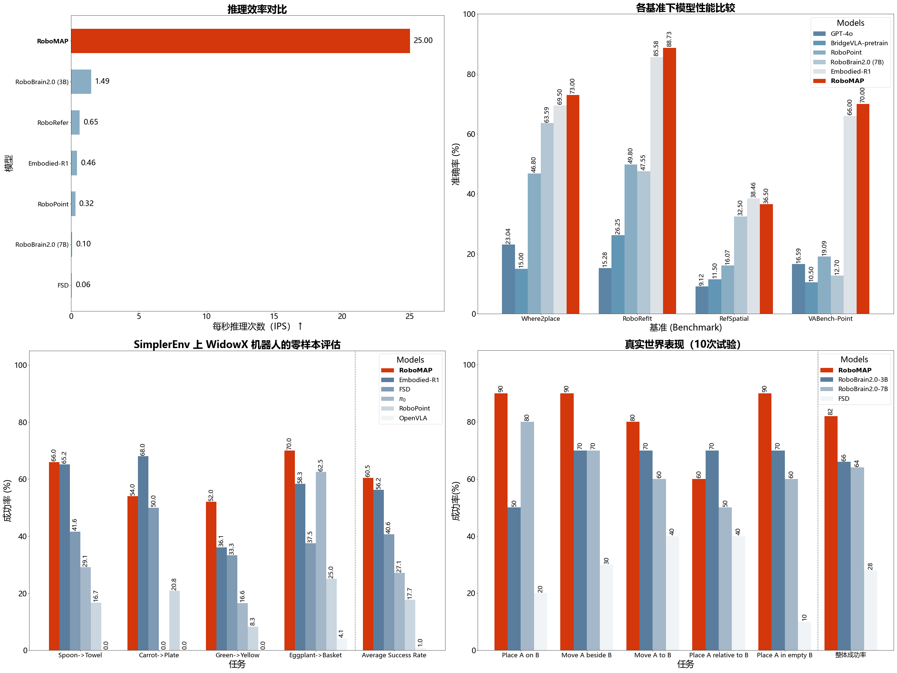
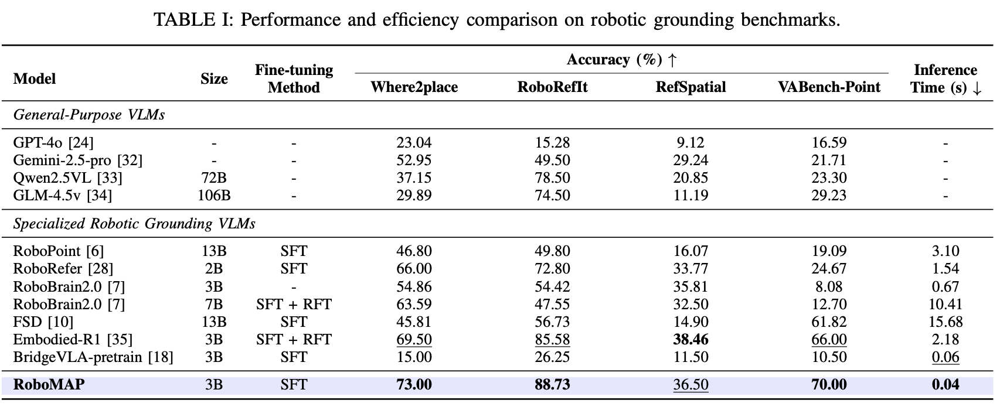

# 50倍速度提升！清华＆华为诺亚推出RoboMAP，破解VLM空间理解瓶颈

# 引言
尽管视觉语言模型（VLM）在感知领域高歌猛进，但在一个关键问题上常常“卡壳”：如何处理空间的不确定性？
想象一下，当指令是“找到那个青色碗旁边的空位”时，现有的主流方法（如基于点或边界框）便显得捉襟见肘。这些离散表示无法捕捉由空间关系定义的复杂、非矩形区域，（如下图所示）。将这种模糊区域强行压缩为点或框，会造成严重的信息瓶颈，导致机器人系统既脆弱又缺乏可解释性。

为攻克这一难题，来自清华大学与华为诺亚方舟实验室的研究人员重磅提出了 RoboMAP 框架。RoboMAP 独辟蹊径，不再输出离散的点，而是生成一种创新的“自适应可供性热力图”。
这种密集的热力图将整个观测空间建模为一个连续的概率分布，能够动态地适应指令的模糊性：对于精确目标，热力图呈现尖锐峰值；而对于模糊指令，则形成广泛的概率分布。这种设计使得机器人能够显式地捕捉和理解复杂的空间概念，从而显著提升在真实世界复杂任务中的成功率与鲁棒性。

这种创新的表示方式，使机器人能够显式地捕捉和理解复杂的空间概念，从而显著提高在现实世界复杂任务中的成功率和鲁棒性。同时，该框架的推理速度比先进的基线模型快50倍以上，推理时间仅为0.04秒，使机器人实时推理成为可能。

# 效果展示

<b>RoboMAP 可视化示例</b>

<b>和其他模型对比</b>

- SOTA 性能： 在 RoboReflt、Where2place、RefSpatial 和 VABench 四大关键空间定位基准上，RoboMAP 在三项中取得了 SOTA 性能。即使在仅使用单一最高置信度点进行评估的约束下，其性能依旧超越了包括 Gemini2.5-pro、RoboBrain2.0 在内的通用及专用 VLM 基线。

- 实时推理： RoboMAP 实现了卓越的计算效率，推理时间仅需 0.04 秒，即达到 25Hz 的实时响应频率。这一速度比同类先进模型快 50 倍以上，真正使机器人的高频实时推理成为可能。

- 零样本泛化： 在仿真（如真实双臂机械臂的 SimplerEnv 环境）与真实机器人环境中的零样本泛化实验均验证了其有效性。RoboMAP 成功零样本迁移到工业单臂分拣与移动导航任务，展现了强大的实际应用价值。

# 方法

为实现这一目标，RoboMAP 在视觉语言骨干网络之后引入了一个新颖的“自适应热力图解码器”（AHD）。该解码器采用内容感知上采样机制，通过“自适应核生成器”（AKG）和“粗略情景预测器”（CAP）两个分支协同工作，使其能根据指令的模糊程度动态调整热力图的形状。

面对缺乏密集热力图标注数据的挑战，研究团队还提出了一种“程序化真值热力图合成”流程。该流程能将不同来源的稀疏标注（如关键点、边界框和机器人轨迹）统一转换为密集、一致的自适应热力图作为监督信号，极大地提升了数据效率，使模型能利用多样化数据进行跨域学习。

# 实验结果
选用包括Gemini2.5-pro、RoboBrain2.0和Embodied-R1在内的通用及专用VLM作为基线模型，并在RoboReflt、Where2place、RefSpatial和VABench四个关键空间定位基准上进行了评估，RoboMAP在三个基准上取得了SOTA表现，且推理速度（0.04秒）相比次优模型提升了50倍以上。

 

仿真与真实机器人环境的零样本泛化实验也验证了RoboMAP的有效性。RoboMAP在真实双臂机械臂的SimplerEnv仿真环境都优于所有基线，并成功零样本迁移到工业单臂分拣与移动导航任务。此外，研究团队还分析了不同解码器架构及不同训练数据组合对性能影响的消融实验，更多内容可以在论文中查看。

